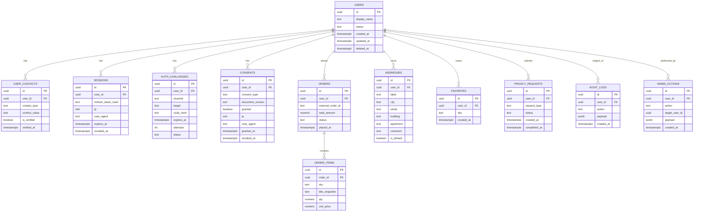

# Личный кабинет `Маркони`

Техническая спецификация MVP с учётом privacy-by-design, базовых требований ИБ и требований законодательства РФ в части обработки персональных данных.

Дата: 2026-07-07  
Статус: draft / для product, backend, frontend, legal review

## 1. Цель

Личный кабинет нужен для:

- повторных заказов
- просмотра истории заказов
- хранения избранных позиций
- управления контактами
- управления адресами доставки, если доставка включена
- управления согласиями и запросами на удаление / экспорт данных

Ключевой принцип: не собирать данные, которые не нужны для сервиса.

## 2. Границы MVP

Входит в MVP:

- вход по `SMS OTP`
- резервный вход по `email magic link` при необходимости
- профиль клиента
- история заказов
- повтор заказа
- избранное
- адресная книга
- экран согласий
- экспорт данных
- удаление аккаунта / запрос на удаление данных
- аудит действий сотрудников в админской части

Не входит в MVP:

- бонусная программа
- хранение банковских карт
- социальные логины
- push-уведомления
- сложные скидочные механики
- рекомендательная система
- хранение чувствительных категорий ПДн

## 3. Категории данных

### 3.1 Что собираем

- `full_name` или `display_name`
- `phone`
- `email` только если нужен бизнес-процессом
- история заказов
- адреса доставки, если есть доставка
- согласия: версия документа, дата/время, IP, user-agent
- сессии и auth-логи

### 3.2 Что не собираем

- дата рождения
- паспортные данные
- фото документов
- фоновая геолокация
- биометрические данные
- чувствительные категории ПДн
- свободные “био”-поля без необходимости

### 3.3 Принципы обработки

- минимизация
- ограничение цели обработки
- ограничение сроков хранения
- разделение доступов
- локализация хранения ПДн в РФ
- отзыв согласия без тёмных паттернов

## 4. Роли и доступы

### 4.1 Роли

- `client`
- `operator`
- `manager`
- `admin`

### 4.2 Права

`client`

- видит только свои данные
- редактирует свои контакты и адреса
- отправляет запрос на удаление или экспорт данных

`operator`

- видит только данные, нужные для обработки заказов
- не видит audit-логи полностью
- не управляет правами других сотрудников

`manager`

- видит заказы и ограниченный профиль клиента
- обрабатывает privacy requests по регламенту

`admin`

- управляет ролями и настройками доступа
- видит админские журналы
- не должен использоваться как обычная рабочая роль

## 5. Пользовательские сценарии

### 5.1 Вход по SMS

1. Пользователь вводит телефон.
2. Система создаёт `auth_challenge`.
3. Пользователь получает OTP.
4. Пользователь вводит код.
5. Система валидирует OTP, создаёт/находит пользователя.
6. Система создаёт сессию.
7. Пользователь попадает в ЛК.

### 5.2 Повтор заказа

1. Пользователь открывает историю заказов.
2. Выбирает заказ.
3. Нажимает `Повторить`.
4. Система переносит позиции в корзину.
5. Пользователь подтверждает состав.

### 5.3 Сохранение адреса

1. Пользователь открывает `Мои адреса`.
2. Добавляет адрес.
3. Система валидирует формат.
4. Адрес сохраняется с привязкой к `user_id`.

### 5.4 Экспорт данных

1. Пользователь открывает раздел приватности.
2. Нажимает `Экспорт данных`.
3. Система создаёт `privacy_request`.
4. После обработки формируется архив / JSON / PDF-выгрузка.

### 5.5 Удаление аккаунта

1. Пользователь открывает раздел приватности.
2. Подтверждает удаление.
3. Система создаёт `privacy_request`.
4. Профиль деактивируется.
5. Данные удаляются или обезличиваются по политике хранения.

## 6. Экраны ЛК

### 6.1 Экран входа

Поля:

- `phone`

Кнопки:

- `Получить код`
- `Войти по email` при включённом fallback

### 6.2 Подтверждение кода

Поля:

- `otp_code`

Элементы:

- таймер повторной отправки
- ссылка `Отправить код ещё раз`

### 6.3 Профиль

Поля:

- `display_name`
- `phone` readonly или с отдельной подтверждаемой сменой
- `email` optional

### 6.4 История заказов

Показываем:

- номер заказа
- дата
- состав
- сумма
- статус
- кнопка `Повторить`

### 6.5 Избранное

Показываем:

- карточки любимых товаров
- удалить из избранного
- добавить в корзину

### 6.6 Адреса

Поля:

- `label` (`Дом`, `Работа`, `Другое`)
- `city`
- `street`
- `building`
- `entrance`
- `floor`
- `apartment`
- `comment`
- `is_default`

### 6.7 Согласия и документы

Показываем:

- согласие на обработку ПДн
- согласие на рекламу
- версия документа
- дата согласия
- статус отзыва

### 6.8 Приватность

Действия:

- экспорт данных
- удаление аккаунта
- отзыв рекламного согласия
- отправка запроса по персональным данным
- просмотр статуса ранее созданных privacy requests

## 7. ER-диаграмма



## 8. SQL-черновик схемы

```sql
create extension if not exists pgcrypto;

create table users (
  id uuid primary key default gen_random_uuid(),
  display_name text,
  status text not null default 'active' check (status in ('active', 'blocked', 'deleted')),
  created_at timestamptz not null default now(),
  updated_at timestamptz not null default now(),
  deleted_at timestamptz
);

create table user_contacts (
  id uuid primary key default gen_random_uuid(),
  user_id uuid not null references users(id) on delete cascade,
  contact_type text not null check (contact_type in ('phone', 'email')),
  contact_value text not null,
  is_verified boolean not null default false,
  verified_at timestamptz,
  created_at timestamptz not null default now(),
  unique (contact_type, contact_value)
);

create table auth_challenges (
  id uuid primary key default gen_random_uuid(),
  user_id uuid references users(id) on delete set null,
  channel text not null check (channel in ('sms', 'email_magic_link')),
  target text not null,
  code_hash text not null,
  expires_at timestamptz not null,
  attempts int not null default 0,
  status text not null default 'pending' check (status in ('pending', 'verified', 'expired', 'cancelled')),
  ip inet,
  user_agent text,
  created_at timestamptz not null default now()
);

create table sessions (
  id uuid primary key default gen_random_uuid(),
  user_id uuid not null references users(id) on delete cascade,
  refresh_token_hash text not null,
  ip inet,
  user_agent text,
  expires_at timestamptz not null,
  revoked_at timestamptz,
  created_at timestamptz not null default now()
);

create table consents (
  id uuid primary key default gen_random_uuid(),
  user_id uuid not null references users(id) on delete cascade,
  consent_type text not null check (consent_type in ('personal_data', 'marketing')),
  document_version text not null,
  granted boolean not null,
  ip inet,
  user_agent text,
  granted_at timestamptz not null default now(),
  revoked_at timestamptz
);

create table addresses (
  id uuid primary key default gen_random_uuid(),
  user_id uuid not null references users(id) on delete cascade,
  label text not null,
  city text not null,
  street text not null,
  building text not null,
  entrance text,
  floor text,
  apartment text,
  comment text,
  is_default boolean not null default false,
  created_at timestamptz not null default now(),
  updated_at timestamptz not null default now()
);

create table orders (
  id uuid primary key default gen_random_uuid(),
  user_id uuid references users(id) on delete set null,
  external_order_id text,
  total_amount numeric(12,2) not null,
  currency text not null default 'RUB',
  status text not null,
  placed_at timestamptz not null default now()
);

create table order_items (
  id uuid primary key default gen_random_uuid(),
  order_id uuid not null references orders(id) on delete cascade,
  sku text not null,
  title_snapshot text not null,
  qty numeric(10,3) not null,
  unit_price numeric(12,2) not null
);

create table favorites (
  id uuid primary key default gen_random_uuid(),
  user_id uuid not null references users(id) on delete cascade,
  sku text not null,
  created_at timestamptz not null default now(),
  unique (user_id, sku)
);

create table privacy_requests (
  id uuid primary key default gen_random_uuid(),
  user_id uuid not null references users(id) on delete cascade,
  request_type text not null check (request_type in ('export', 'delete', 'revoke_marketing', 'other')),
  status text not null default 'new' check (status in ('new', 'in_progress', 'completed', 'rejected')),
  requested_by_user boolean not null default true,
  payload jsonb not null default '{}'::jsonb,
  created_at timestamptz not null default now(),
  completed_at timestamptz
);

create table audit_logs (
  id uuid primary key default gen_random_uuid(),
  actor_user_id uuid references users(id) on delete set null,
  target_user_id uuid references users(id) on delete set null,
  action text not null,
  payload jsonb not null default '{}'::jsonb,
  created_at timestamptz not null default now()
);

create index idx_user_contacts_user_id on user_contacts(user_id);
create index idx_sessions_user_id on sessions(user_id);
create index idx_orders_user_id on orders(user_id);
create index idx_addresses_user_id on addresses(user_id);
create index idx_favorites_user_id on favorites(user_id);
create index idx_consents_user_id on consents(user_id);
create index idx_privacy_requests_user_id on privacy_requests(user_id);
```

## 9. API-контракты MVP

### 9.1 Auth

`POST /api/auth/start`

Request:

```json
{
  "channel": "sms",
  "phone": "+79892894777"
}
```

Response:

```json
{
  "challengeId": "uuid",
  "retryAfterSec": 60
}
```

`POST /api/auth/verify`

```json
{
  "challengeId": "uuid",
  "code": "123456"
}
```

Response:

```json
{
  "accessToken": "jwt-or-session-token",
  "refreshToken": "opaque-token",
  "user": {
    "id": "uuid",
    "displayName": "Иван"
  }
}
```

`POST /api/auth/logout`

### 9.2 Profile

`GET /api/me`

`PATCH /api/me`

```json
{
  "displayName": "Иван"
}
```

### 9.3 Orders

`GET /api/me/orders`

`POST /api/me/orders/:id/repeat`

### 9.4 Favorites

`GET /api/me/favorites`

`POST /api/me/favorites`

```json
{
  "sku": "croissant-classic"
}
```

`DELETE /api/me/favorites/:sku`

### 9.5 Addresses

`GET /api/me/addresses`

`POST /api/me/addresses`

`PATCH /api/me/addresses/:id`

`DELETE /api/me/addresses/:id`

### 9.6 Consents and privacy

`GET /api/me/consents`

`POST /api/me/privacy/export`

`POST /api/me/privacy/delete`

`POST /api/me/privacy/revoke-marketing`

## 10. Безопасность

### 10.1 Аутентификация

- приоритет `OTP`
- короткий TTL для кода
- лимит попыток
- rate limit на номер / IP / challenge
- анти-enumeration: одинаковый ответ на существующий и несуществующий аккаунт

### 10.2 Сессии

- `HttpOnly`
- `Secure`
- `SameSite=Lax` или строже
- ротация refresh token
- отзыв всех сессий по запросу

### 10.3 Backend

- RBAC на уровне endpoint и сервиса
- CSRF-защита для cookie-based сценариев
- валидация payload по schema
- централизованный audit log
- запрет выдачи лишних полей клиенту

### 10.4 Логи

- не логировать OTP, magic links, токены
- маскировать телефон и email
- ограничить срок хранения auth-логов

### 10.5 Админская часть

- отдельный домен/контур доступа по возможности
- MFA для сотрудников
- аудит чтения и изменения ПДн
- least privilege

## 11. Сроки хранения

Точные сроки должны быть утверждены юристом и внутренней политикой.

Черновой подход:

- `auth_challenges`: 30 дней
- `sessions`: до завершения + короткий архивный хвост
- `consents`: весь срок действия + период для доказывания правомерности
- `orders`: по бизнес- и налоговым требованиям
- `addresses`: пока активны или до удаления пользователем
- `audit_logs`: по политике ИБ
- удалённые аккаунты: деактивация сразу, физическое удаление / обезличивание по регламенту

## 12. Документы и согласия

Обязательные артефакты перед запуском:

- Политика конфиденциальности
- Политика обработки ПДн
- Согласие на обработку ПДн
- Отдельное согласие на рекламу / рассылки
- Регламент обработки запросов субъектов ПДн
- Регламент реагирования на инциденты
- Матрица доступов сотрудников

## 13. Чек-лист запуска по РФ

- [ ] Определён оператор ПДн
- [ ] Проведена инвентаризация данных и целей обработки
- [ ] Утверждены правовые основания обработки
- [ ] Данные пользователей РФ локализованы в РФ
- [ ] Определена необходимость уведомления Роскомнадзора
- [ ] Подготовлены тексты согласий и политика обработки
- [ ] Настроен отзыв согласия
- [ ] Настроен экспорт и удаление данных
- [ ] Настроен журнал действий сотрудников
- [ ] Настроен процесс реагирования на инциденты
- [ ] Проведён security review
- [ ] Проведён legal review

## 14. Официальные ориентиры

- Роскомнадзор: уведомление оператора ПДн  
  https://pd.rkn.gov.ru/operators-registry/notification/
- Роскомнадзор: уведомление об инциденте  
  https://pd.rkn.gov.ru/incidents/
- 242-ФЗ о локализации персональных данных  
  https://publication.pravo.gov.ru/document/0001201407220042
- ПП РФ №1119 о требованиях к защите ПДн  
  https://publication.pravo.gov.ru/Document/View/0001201211070009
- Изменения законодательства, связанные с ПДн  
  https://publication.pravo.gov.ru/document/0001202502280034

## 15. Следующий технический шаг

Рекомендуемый следующий артефакт:

1. backend RFC по auth и privacy
2. JSON-schema / zod-схемы для всех форм
3. wireframes экранов ЛК
4. перечень текстов согласий и чекбоксов
5. threat model для auth, admin и privacy requests
